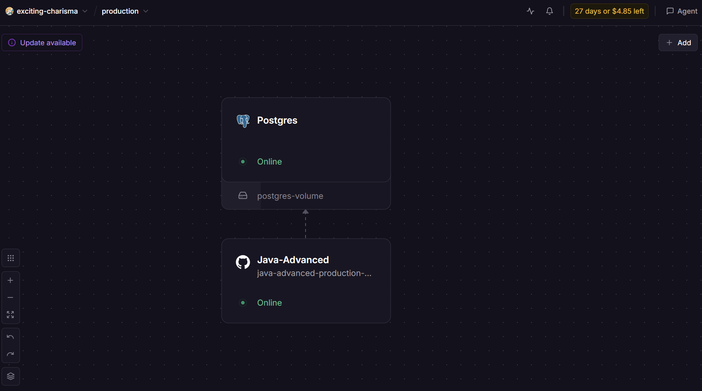

# PetGuardian API

> **Challenge FIAP - Java Advanced (Spring Boot)**
>
> Plataforma corporativa para gestão da saúde e rotina de cuidados do pet em família sob a **Arquitetura Pet-Centric**.

<p>
  
  
  
  
  
  
  
  
</p>

| Link Rápido | URL |
|---|---|
| **Repositório GitHub** | https://github.com/Challenge-Pet-Guardian-3/Java-Advanced |
| **API em Produção (Railway)** | https://java-advanced-production-35ab.up.railway.app |
| **Swagger UI Interativo (Produção)** | https://java-advanced-production-35ab.up.railway.app/swagger-ui/index.html |
| **OpenAPI Docs JSON (Produção)** | https://java-advanced-production-35ab.up.railway.app/v3/api-docs |
| **Actuator Health (Produção)** | https://java-advanced-production-35ab.up.railway.app/actuator/health |
| **Swagger UI (Local)** | http://localhost:8080/swagger-ui/index.html |
| **Arquivo de Coleção Insomnia** | [/docs/Insomnia_2026-05-21.yaml](./docs/Insomnia_2026-05-21.yaml) |

## 🔗 Vídeo de Demonstração

[Vídeo de Demonstração](https://youtu.be/HAolZI8EX0M)

---

## Integrantes

| Nome | RM | Turma | GitHub | LinkedIn |
| :--- | :---: | :---: | :--- | :--- |
| **Enzo Okuizumi** | **561432** | 2TDSPG | [EnzoOkuizumiFiap](https://github.com/EnzoOkuizumiFiap) | [Enzo Okuizumi](https://www.linkedin.com/in/enzo-okuizumi-b60292256/) |
| **Gustavo Okada** | **563428** | 2TDSPG | [Gdev3356](https://github.com/Gdev3356) | [Gustavo Okada](https://www.linkedin.com/in/gustavo-okada-53a3b8359/) |
| **Lucas Barros Gouveia** | **566422** | 2TDSPG | [LuzBGouveia](https://github.com/LuzBGouveia) | [Lucas Barros Gouveia](https://www.linkedin.com/in/lucas-barros-gouveia-09b147355/) |
| **Luna de Carvalho Guimarães** | **562290** | 2TDSPG | [lunaguima](https://github.com/lunaguima) | [Luna M. Guimarães](https://www.linkedin.com/in/luna-m-guimar%C3%A3es-1850ab173/) |
| **Milton Marcelino** | **564836** | 2TDSPG | [MiltonMarcelino](https://github.com/MiltonMarcelino) | [Milton Marcelino](http://linkedin.com/in/milton-marcelino-250298142) |

---

## Sobre o Projeto

O **PetGuardian** é uma API REST corporativa desenvolvida em **Spring Boot** para o ecossistema FIAP Challenge (Mentoria Clyvo 2026), estruturada sob a **Arquitetura Pet-Centric**. A plataforma resolve o desafio contemporâneo da divisão de cuidados com animais de estimação entre membros de uma família ou cuidadores compartilhados, unindo governança colaborativa, gamificação com pontuação de bem-estar e trilhas de aprendizagem.

### 🌟 Pilares da Arquitetura Pet-Centric
- **Ecossistema Centrado no Animal:** O pet não é um atributo secundário do usuário, mas a entidade nuclear (`pet`), acumulando histórico clínico, tarefas da rotina diária e pontuação própria de bem-estar.
- **Rede de Cuidado Familiar (Care Circle):** Um animal pode possuir múltiplos cuidadores com distinção de autoridade: um **Tutor Principal** (com autoridade sobre deleção e gestão de co-cuidadores) e múltiplos **Co-cuidadores** colaborativos com visibilidade em tempo real.
- **Gamificação de Bem-Estar em Dupla Camada:**
  - `pontos_tarefa`: Conquistados pelos cuidadores ao executar cuidados essenciais de rotina (alimentar, medicar, passear, higienizar).
  - `pontos_aula`: Conquistados ao finalizar lições educativas de adestramento e boas práticas, agregando pontos diretamente ao score de bem-estar do pet.
- **Ciclo de Vida Auditável:** Transições de status automatizadas (`PENDENTE`, `CONCLUIDO`, `EXPIRADO`), com suporte nativo a desmarcação imediata e auditoria de conclusões.

---

## ☁️ Arquitetura e Deploy em Nuvem (Railway)

A API **PetGuardian** e seu banco de dados relacional **PostgreSQL 16** estão provisionados e operando em alta disponibilidade em ambiente de produção no **Railway**:

* **Microsserviço da Aplicação (`Java-Advanced`):** Container Spring Boot 4.1.1 (Java 17 LTS / Gradle) com pipeline de entrega contínua vinculado ao GitHub, operando com status `Online`.
* **Banco de Dados Relacional (`Postgres`):** Instância PostgreSQL 16 provisionada com volume persistente montado (`postgres-volume`), garantindo durabilidade das tabelas, histórico clínico e rotinas.
* **Rede Privada Integrada:** Comunicação de baixa latência entre o container da aplicação e o container de banco de dados.



---

## Modelagem Lógica e Relacional do Banco de Dados

### Modelo Lógico 


### Modelo Relacional


---

## Arquitetura

```
src/main/java/fiap/com/br/petguardian/
├── auth/                # Autenticação stateless, SecurityConfig (RBAC), Tokens JWT com chaves RSA
├── config/              # OpenAPI/Swagger, beans globais e RestClient
├── exception/           # Tratamento centralizado de exceções (GlobalExceptionHandler)
├── validation/          # Validadores de domínio (CEP, DDD, Enum, integridade de cuidadores, unicidade de nomes via @NomeUnicoValidation)
│
├── usuario/             # Gestão de usuários/tutores, perfis RBAC e visão agregada da rede
├── usuariopet/          # Relação N:N Usuário x Pet (Care Circle, vínculos, transferência de tutela)
├── pet/                 # Núcleo do pet, raças, score consolidado e histórico compartilhado
│   ├── raca/            # Catálogo e autocriação de raças
│   └── historico/       # Prontuário clínico de saúde (vacinas)
│
├── tarefa/              # Rotina gamificada de cuidados, ciclo de vida e cálculo de pontos
│   └── status/          # Status de domínio (PENDENTE, CONCLUIDO, EXPIRADO)
│
├── trilha/              # Trilhas educativas de adestramento (RBAC: PREMIUM / ADMIN)
│   ├── modulo/          # Módulos temáticos da trilha
│   └── aula/            # Aulas com conteúdo didático e pontuação educacional
│
├── endereco/            # Endereço integrado declarativamente ao ViaCEP via @HttpExchange
│   ├── bairro/          # Normalização de bairros
│   ├── cidade/          # Normalização de municípios
│   └── estado/          # Normalização de estados federativos
│
└── telefone/            # Telefones de contato normalizados por DDD e número
```

---

## Tecnologias Utilizadas

| Tecnologia | Versão | Finalidade |
|---|---|---|
| **Java** | 17 LTS | Linguagem oficial do ecossistema corporativo |
| **Spring Boot** | 4.1.1 | Framework base para microsserviços REST corporativos |
| **Spring Data JPA / Hibernate** | Integrado | Mapeamento Objeto-Relacional (ORM) e consultas dinâmicas otimizadas |
| **PostgreSQL** | 16-alpine | Sistema Gerenciador de Banco de Dados Relacional |
| **Flyway Migration** | 10.x | Controle versionado e idempotente do schema e cargas do banco |
| **Spring Security & OAuth2** | Integrado | Segurança stateless e Resource Server com validação de tokens JWT |
| **Nimbus JOSE + JWT** | Integrado | Criptografia assimétrica RSA (2048-bit) para assinatura e decodificação de tokens |
| **Spring Validation** | Integrado | Bean Validation declarativo em DTOs Records puros/imutáveis (@NomeUnicoValidation, @CepValidation, etc.) |
| **SpringDoc OpenAPI 3** | 2.8.5 | Geração automática de documentação e console interativo Swagger UI |
| **HTTP Service Interfaces** | Integrado | Cliente declarativo (`@HttpExchange`) para consumo assíncrono/síncrono do ViaCEP |
| **Spring Boot Actuator** | Integrado | Observabilidade com métricas e healthcheck de infraestrutura |
| **Docker & Docker Compose** | Multi-platform | Containerização e ambiente isolado para o banco de dados |
| **Lombok** | Integrado | Redução de código boilerplate |
| **Gradle** | 8.x | Gerenciamento determinístico de dependências e build |

---

## 🔐 Spring Security, RBAC & Credenciais de Avaliação

> **Atendimento aos Requisitos da Sprint 3 FIAP (30 Pontos):**
> O sistema adota segurança stateless com autenticação JWT e par de chaves assimétricas **RSA** (`private_key.pem` e `public_key.pem`).
> A autorização é controlada por **Role-Based Access Control (RBAC)** em 3 níveis hierárquicos: `COMUM`, `PREMIUM` e `ADMIN`.

### 🛡️ Matriz de Permissões por Perfil

| Recurso / Rota | Método HTTP | `COMUM` | `PREMIUM` | `ADMIN` | Comportamento em Caso de Violação |
|---|---|:---:|:---:|:---:|---|
| `/login` | `POST` | 🔓 Livre | 🔓 Livre | 🔓 Livre | Rota pública para obtenção do token JWT |
| `/usuarios` (Cadastro) | `POST` | 🔓 Livre | 🔓 Livre | 🔓 Livre | Rota pública de onboarding de novos tutores |
| `/usuarios/**`, `/pets/**`, `/tarefas/**`, `/historicos/**`, `/enderecos/**` | Todos | 🔒 Autenticado | 🔒 Autenticado | 🔒 Autenticado | `401 Unauthorized` se sem token |
| `/trilhas`, `/modulos`, `/aulas` | `GET` | ❌ Bloqueado | ✅ Permitido | ✅ Permitido | `403 Forbidden` para tutores comuns |
| `/aulas/*/concluir`, `/aulas/*/desmarcar` | `PATCH` | ❌ Bloqueado | ✅ Permitido | ✅ Permitido | `403 Forbidden` para tutores comuns |
| `/trilhas/**`, `/modulos/**`, `/aulas/**` (Gestão/CRUD) | `POST`, `PUT`, `DELETE` | ❌ Bloqueado | ❌ Bloqueado | ✅ Permitido | `403 Forbidden` para tutores comuns e premium |

### 🔑 Credenciais Pré-Cadastradas para Teste

Para agilizar a correção e os testes da banca avaliadora, os seguintes usuários já se encontram provisionados com tokens válidos e senhas criptografadas via **BCrypt**:

| Perfil (Role) | E-mail | Senha | Finalidade de Teste |
|---|---|---|---|
| **ADMIN** | `enzo.admin@petguardian.com` | `Admin@123456` | Acesso completo a todo o sistema, incluindo criação e deleção de trilhas, módulos e aulas educativas. |
| **PREMIUM** | `carolina.cuidadora@petguardian.com` | `User@123456` | Gestão de pets, tarefas da família e consumo/conclusão de aulas e trilhas educativas de adestramento. |
| **COMUM** | *(Qualquer usuário com role `COMUM`)* | *(Cadastrado em `/usuarios`)* | Gestão de rotinas e pets. Ao tentar acessar `/trilhas`, a API retorna `403 Forbidden`. |

---

## 🗃️ Controle de Migrações de Banco (Flyway)

> **Atendimento aos Requisitos da Sprint 3 FIAP (20 Pontos):**
> O banco de dados é inteiramente versionado e gerenciado pelo **Flyway**, garantindo reprodutibilidade do schema e cargas essenciais em qualquer ambiente sem necessidade de scripts manuais.

As migrações estão localizadas em `src/main/resources/db/migration/`:

- **`V1__criar_tabelas.sql`**:
  - DDL completo das 15 tabelas relacionais do sistema (`usuario`, `pet`, `raca`, `usuario_pet`, `tarefa`, `status`, `historico`, `trilha`, `modulo`, `aula`, `endereco`, `bairro`, `cidade`, `estado`, `telefone`, `usuario_endereco`).
  - Criação de todas as constraints de integridade referencial (`FOREIGN KEY`), chaves primárias e índices únicos (`uc_usuario_email`, `uc_raca_nome_raca`, `uc_status_nome_status`).
  - Tabelas de auditoria do Hibernate Envers (`revinfo`, `revchanges`) com sequence de revisão `revinfo_seq`.
- **`V2__carga_inicial_status.sql`**:
  - Carga e garantia dos registros fundamentais da tabela de domínio `status`:
    - `1 - PENDENTE`
    - `2 - CONCLUIDO`
    - `3 - EXPIRADO`

Configurações ativas no `application.properties`:
```properties
spring.flyway.enabled=true
spring.flyway.baseline-on-migrate=true
spring.flyway.repair-on-migrate=true
spring.flyway.locations=classpath:db/migration
```

---

## 🚀 Fluxos Completos do Sistema (Além de CRUD)

> **Atendimento aos Requisitos da Sprint 3 FIAP (20 Pontos):**
> O sistema implementa múltiplos fluxos de ponta a ponta com regras de negócio corporativas complexas:

### 1. Fluxo de Gamificação e Ciclo de Vida da Rotina
1. **Criação de Tarefa:** O tutor cria uma rotina (`/tarefas`) vinculando pet e responsável. O sistema valida se o usuário pertence à rede de cuidado do animal (`UsuarioPetValidator`) e inicializa com status `PENDENTE`.
2. **Auto-Expiração Inteligente:** Ao listar tarefas, o método `expirarTarefasPendentesAtrasadas()` avalia o `prazo` contra o relógio do servidor (`LocalDateTime.now()`) e transiciona tarefas atrasadas para `EXPIRADO` de forma automática.
3. **Conclusão e Gamificação:** O cuidador conclui a tarefa via `PATCH /tarefas/{id}/concluir`. O sistema credita imediatamente os pontos ao cuidador (`calcularPontosTotaisUsuario`) e soma ao score de bem-estar do pet.
4. **Desmarcação Resiliente:** Se houver necessidade de cancelamento ou correção operacional, o endpoint `PATCH /tarefas/{id}/desmarcar?usuarioId=` valida a titularidade do cuidador, remove os pontos acumulados e retorna a tarefa para `PENDENTE`.

### 2. Fluxo de Governança Familiar Pet-Centric (Care Circle)
1. **Titularidade Automática no Nascimento do Pet:** Ao cadastrar um pet (`POST /pets`), o tutor criador é registrado imediatamente na tabela `usuario_pet` com a flag `responsavel_principal = true`.
2. **Convite de Co-cuidadores:** O responsável principal convida familiares ou cuidadores (`POST /pets/{petId}/cuidadores`) informando o e-mail do convidado.
3. **Visão Agregada da Família:** O endpoint `GET /usuarios/{id}/rede-cuidado` consolida todos os animais sob responsabilidade do usuário, a lista completa de co-cuidadores de cada animal e as tarefas pendentes/concluídas da semana.
4. **Transferência de Responsabilidade Principal:** Caso a guarda ou tutela principal mude, o endpoint `PATCH /pets/{petId}/responsavel-principal` valida se a solicitação partiu do titular atual e transfere atomicamente os privilégios administrativos para o novo cuidador.

### 3. Fluxo de Trilhas Educativas com Restrição RBAC
1. **Curadoria de Conteúdo (ADMIN):** Administradores criam trilhas (`POST /trilhas`), módulos (`POST /modulos`) e lições (`POST /aulas`).
2. **Acesso Exclusivo (PREMIUM/ADMIN):** Tutores com perfil `PREMIUM` acessam as lições educativas de adestramento e boas práticas. Tutores `COMUM` recebem `403 Forbidden`.
3. **Pontuação Educacional do Pet:** Ao finalizar lições (`PATCH /aulas/{id}/concluir`), a pontuação educacional é calculada e integrada ao score consolidado do animal consultado em `GET /pets/{id}/pontos`.

### 4. Fluxo de Integração Declarativa de Endereço via ViaCEP
1. **Consumo sem Boilerplate:** Utilizando HTTP Service Interfaces (`@HttpExchange`), o serviço `ViaCepService` consome a API do ViaCEP (`https://viacep.com.br/ws/{cep}/json`).
2. **Normalização Automática de Entidades:** O `EnderecoService` decompõe a resposta, garantindo a normalização e reaproveitamento de `Bairro`, `Cidade` e `Estado` no PostgreSQL sem duplicidades.

---

## 📡 Catálogo Completo de Endpoints

### 1. Autenticação (`/login`)
| Método | Endpoint | Descrição | Permissão |
|---|---|---|---|
| `POST` | `/login` | Autentica com e-mail/senha e emite token JWT assinado via RSA com dados do perfil | Pública |

*Exemplo de Request:*
```json
{
  "email": "enzo.admin@petguardian.com",
  "senha": "Admin@123456"
}
```

*Exemplo de Response (200 OK):*
```json
{
  "token": "eyJhbGciOiJSUzI1NiJ9...",
  "user": {
    "id": 1,
    "nome": "Enzo Administrador",
    "email": "enzo.admin@petguardian.com",
    "role": "ADMIN",
    "ddd": "11",
    "numeroTelefone": "987654321",
    "enderecos": []
  }
}
```

---

### 2. Usuários (`/usuarios`)
| Método | Endpoint | Descrição | Permissão |
|---|---|---|---|
| `GET` | `/usuarios` | Listar usuários cadastrados com paginação (`?page=0&size=10&sort=nome,asc`) | Autenticado |
| `GET` | `/usuarios/by-nome` | Buscar usuários por nome (`?nome=Enzo`) | Autenticado |
| `GET` | `/usuarios/by-email` | Buscar usuário por e-mail exato (`?email=...`) | Autenticado |
| `GET` | `/usuarios/{id}` | Obter detalhes de um usuário por ID | Autenticado |
| `GET` | `/usuarios/{id}/rede-cuidado` | Visão agregada da rede de cuidado (pets vinculados, co-cuidadores e rotinas) | Autenticado |
| `POST` | `/usuarios` | Cadastrar novo tutor/usuário (com validação integrada de endereço ViaCEP) | Pública |
| `PUT` | `/usuarios/{id}` | Atualizar dados cadastrais do usuário | Autenticado |
| `DELETE` | `/usuarios/{id}` | Remover usuário | Autenticado |

---

### 3. Pets (`/pets`)
| Método | Endpoint | Descrição | Permissão |
|---|---|---|---|
| `GET` | `/pets` | Listar todos os pets do sistema com paginação | Autenticado |
| `GET` | `/pets/by-usuario` | Listar todos os pets vinculados ao usuário (`?usuarioId=1`) como titular ou co-cuidador | Autenticado |
| `GET` | `/pets/by-nome` | Filtrar pets por nome (`?nome=Thor`) | Autenticado |
| `GET` | `/pets/{id}` | Buscar pet por ID | Autenticado |
| `GET` | `/pets/{id}/historico` | Histórico compartilhado consolidado de tarefas concluídas de um pet | Autenticado |
| `GET` | `/pets/{id}/pontos` | Score total consolidado (Tarefas de rotina + Aulas educativas) | Autenticado |
| `POST` | `/pets` | Cadastrar pet e vincular criador automaticamente como responsável principal | Autenticado |
| `PUT` | `/pets/{id}` | Atualizar dados do pet (autorizado apenas para o responsável principal) | Autenticado |
| `DELETE` | `/pets/{id}` | Remover pet (`?usuarioId=1` - restrito ao responsável principal) | Autenticado |

---

### 4. Care Circle & Co-cuidadores (`/pets/{petId}`)
| Método | Endpoint | Descrição | Permissão |
|---|---|---|---|
| `GET` | `/pets/{petId}/cuidadores` | Listar todos os cuidadores e tutores vinculados ao pet | Autenticado |
| `POST` | `/pets/{petId}/cuidadores` | Convidar co-cuidador por e-mail (requer `responsavelPrincipalId` e `email`) | Autenticado |
| `DELETE` | `/pets/{petId}/cuidadores/{usuarioId}` | Desvincular co-cuidador do animal (`?solicitanteId=1`) | Autenticado |
| `PATCH` | `/pets/{petId}/responsavel-principal` | Transferir a titularidade de responsável principal para outro co-cuidador | Autenticado |

---

### 5. Tarefas da Rotina (`/tarefas`)
| Método | Endpoint | Descrição | Permissão |
|---|---|---|---|
| `GET` | `/tarefas` | Listar todas as tarefas com auto-expiração automática de atrasadas | Autenticado |
| `GET` | `/tarefas/by-usuario` | Listar tarefas do cuidador com filtro opcional (`?usuarioId=1&status=ALL\|PENDENTE...`) | Autenticado |
| `GET` | `/tarefas/by-pet/{petId}` | Listar todas as tarefas da rotina de um pet | Autenticado |
| `GET` | `/tarefas/{id}` | Buscar tarefa por ID | Autenticado |
| `GET` | `/tarefas/by-usuario/{usuarioId}/{id}` | Buscar tarefa por cuidador e ID | Autenticado |
| `GET` | `/tarefas/by-usuario/pontos` | Obter total de pontos acumulados pelo cuidador (`?usuarioId=1`) | Autenticado |
| `POST` | `/tarefas` | Criar nova rotina de cuidado (exige que o usuário seja cuidador do pet) | Autenticado |
| `PUT` | `/tarefas/{id}` | Atualizar dados e status da tarefa | Autenticado |
| `PATCH` | `/tarefas/{id}/concluir` | Concluir tarefa (body: `{"concluinteId": 1}`) gerando pontos de bem-estar | Autenticado |
| `PATCH` | `/tarefas/{id}/desmarcar` | Desmarcar tarefa concluída (`?usuarioId=1`) voltando ao status `PENDENTE` e estornando pontos | Autenticado |
| `DELETE` | `/tarefas/{id}` | Excluir tarefa | Autenticado |

---

### 6. Histórico Clínico de Saúde (`/historicos`)
| Método | Endpoint | Descrição | Permissão |
|---|---|---|---|
| `GET` | `/historicos` | Listar registros clínicos com paginação | Autenticado |
| `GET` | `/historicos/pet/{petId}` | Prontuário médico de eventos do pet ordenados por data | Autenticado |
| `GET` | `/historicos/{id}` | Obter detalhes do registro de saúde por ID | Autenticado |
| `POST` | `/historicos` | Registrar vacina, consulta, exame ou cirurgia | Autenticado |
| `PUT` | `/historicos/{id}` | Atualizar registro de histórico clínico | Autenticado |
| `DELETE` | `/historicos/{id}` | Excluir registro de histórico clínico | Autenticado |

---

### 7. Trilhas Educativas (`/trilhas`)
| Método | Endpoint | Descrição | Permissão |
|---|---|---|---|
| `GET` | `/trilhas` | Listar todas as trilhas disponíveis | `PREMIUM`, `ADMIN` |
| `GET` | `/trilhas/pet/{petId}` | Listar trilhas atribuídas a um pet | `PREMIUM`, `ADMIN` |
| `GET` | `/trilhas/{id}` | Buscar trilha por ID | `PREMIUM`, `ADMIN` |
| `POST` | `/trilhas` | Criar nova trilha educativa | `ADMIN` |
| `PUT` | `/trilhas/{id}` | Atualizar trilha existente | `ADMIN` |
| `DELETE` | `/trilhas/{id}` | Excluir trilha e cascatear remoção para módulos e aulas | `ADMIN` |

---

### 8. Módulos das Trilhas (`/modulos`)
| Método | Endpoint | Descrição | Permissão |
|---|---|---|---|
| `GET` | `/modulos` | Listar todos os módulos educativos | `PREMIUM`, `ADMIN` |
| `GET` | `/modulos/trilha/{trilhaId}` | Listar módulos de uma trilha específica | `PREMIUM`, `ADMIN` |
| `GET` | `/modulos/{id}` | Buscar módulo por ID | `PREMIUM`, `ADMIN` |
| `POST` | `/modulos` | Criar módulo associado a uma trilha | `ADMIN` |
| `PUT` | `/modulos/{id}` | Atualizar módulo existente | `ADMIN` |
| `DELETE` | `/modulos/{id}` | Excluir módulo e suas aulas | `ADMIN` |

---

### 9. Aulas Educativas (`/aulas`)
| Método | Endpoint | Descrição | Permissão |
|---|---|---|---|
| `GET` | `/aulas` | Listar todas as aulas | `PREMIUM`, `ADMIN` |
| `GET` | `/aulas/modulo/{moduloId}` | Listar lições associadas a um módulo | `PREMIUM`, `ADMIN` |
| `GET` | `/aulas/{id}` | Buscar lição por ID | `PREMIUM`, `ADMIN` |
| `POST` | `/aulas` | Criar lição com pontuação didática | `ADMIN` |
| `PUT` | `/aulas/{id}` | Atualizar lição | `ADMIN` |
| `PATCH` | `/aulas/{id}/concluir` | Marcar aula como concluída e somar pontos ao score do pet | `PREMIUM`, `ADMIN` |
| `PATCH` | `/aulas/{id}/desmarcar` | Desmarcar aula e estornar pontos educacionais do pet | `PREMIUM`, `ADMIN` |
| `DELETE` | `/aulas/{id}` | Deletar aula | `ADMIN` |

---

### 10. Endereços (`/enderecos`)
| Método | Endpoint | Descrição | Permissão |
|---|---|---|---|
| `GET` | `/enderecos` | Listar endereços cadastrados | Autenticado |
| `GET` | `/enderecos/{id}` | Buscar endereço por ID | Autenticado |
| `POST` | `/enderecos` | Criar endereço com consulta automática ao ViaCEP (body: `{"cep": "01310-000", "numero": "100"}`) | Autenticado |
| `PUT` | `/enderecos/{id}` | Atualizar endereço | Autenticado |
| `DELETE` | `/enderecos/{id}` | Remover endereço | Autenticado |

---

## 💻 Como Executar

### Pré-requisitos
- **Java 17 LTS** instalado e configurado no `JAVA_HOME`.
- **Git** para clonagem do repositório.
- *(Opcional)* **Docker e Docker Compose**, caso prefira rodar o banco localmente em vez de usar o PostgreSQL da nuvem no Railway.

---

### Configuração de Ambientes (`.env`)

A aplicação possui suporte a **dois ambientes transparentes**. O arquivo `application.properties` já possui as credenciais do **PostgreSQL no Railway configuradas como fallback padrão**, permitindo rodar o projeto imediatamente sem nenhuma dependência de container local.

Caso queira customizar, copie o `.env.example` para `.env` na raiz do projeto:

```bash
cp .env.example .env
```

---

### Passos de Execução

#### Opção 1: Executar Direto com Banco na Nuvem (Railway - Padrão)
Não requer Docker nem configuração de variáveis. O Flyway executará as migrações automaticamente:

```bash
# No Linux / macOS:
./gradlew bootRun

# No Windows (PowerShell / CMD):
.\gradlew.bat bootRun
```
*(Ou execute a classe `PetGuardianApplication.java` diretamente pela sua IDE favorita).*

---

#### Opção 2: Executar Localmente com Docker Compose
1. Subir o container do PostgreSQL:
```bash
docker compose up -d
```

2. Configurar as variáveis para apontar para o container local:
```powershell
# PowerShell:
$env:PGHOST="localhost"
$env:PGPORT="5432"
$env:PGDATABASE="petguardian"
$env:PGUSER="petguardian"
$env:PGPASSWORD="petguardian"
```

3. Iniciar o Spring Boot:
```powershell
.\gradlew.bat bootRun
```

---

## 🧪 Testes Automatizados e Script E2E

### 1. Testes Unitários e de Integração (JUnit 5 + Mockito + Spring Security Test)
Para rodar toda a suíte de testes de autenticação, validações, serviços e controllers:

```bash
./gradlew test
```

Os relatórios detalhados de execução dos testes são gerados em:
`build/reports/tests/test/index.html`

---

### 2. Script de Validação E2E e Seed Automático (`seed-railway.ps1`)
O repositório inclui um script em PowerShell completo, idempotente e automatizado que valida o ciclo de vida completo da API em produção ou em localhost:

```powershell
# Executar contra a API em produção (Railway):
powershell -ExecutionPolicy Bypass -File .\seed-railway.ps1

# Ou executar contra o servidor local:
powershell -ExecutionPolicy Bypass -File .\seed-railway.ps1 -BaseUrl "http://localhost:8080"
```

**O que o script executa e valida:**
1. Healthcheck do Actuator (`/actuator/health`).
2. Cadastro dos usuários `ADMIN` e `PREMIUM` com CEPs reais validados no ViaCEP.
3. Autenticação JWT (`/login`) e extração do Bearer Token.
4. Cadastro de 3 pets com raças normalizadas.
5. Vínculo de co-cuidadores no Care Circle.
6. Criação de tarefas futuras, execução de `PATCH /concluir` e verificação da soma de pontos.
7. Cadastro de eventos no prontuário de saúde (`/historicos`).
8. Criação de trilhas, módulos e lições educativas com verificação das restrições RBAC.

---

## ⚠️ Tratamento de Erros

A API possui interceptador global (`@RestControllerAdvice` em `GlobalExceptionHandler`) que padroniza os erros nos formatos:

### Formato 1: Erros de Validação de Campos (`400 Bad Request`)
Disparado por falhas no Bean Validation (`@NotBlank`, `@NotNull`, `@NomeUnicoValidation`, `@CepValidation`, `@DddValidation`, etc.):
```json
{
  "erros": [
    {
      "campo": "email",
      "mensagem": "deve ser um endereço de e-mail bem formado"
    },
    {
      "campo": "nome",
      "mensagem": "não deve estar em branco"
    }
  ]
}
```

### Formato 2: Erros de Domínio, Não Encontrado e Segurança
Disparado por `ResourceNotFoundException` (`404`), `IllegalArgumentException` (`400`), `AuthenticationException` (`401`), `AccessDeniedException` (`403`) ou `Exception` genérica (`500`):
```json
{
  "timestamp": "2026-09-11T19:50:00Z",
  "status": 403,
  "error": "Forbidden",
  "message": "Voce nao possui permissao para este recurso.",
  "path": "/trilhas"
}
```
